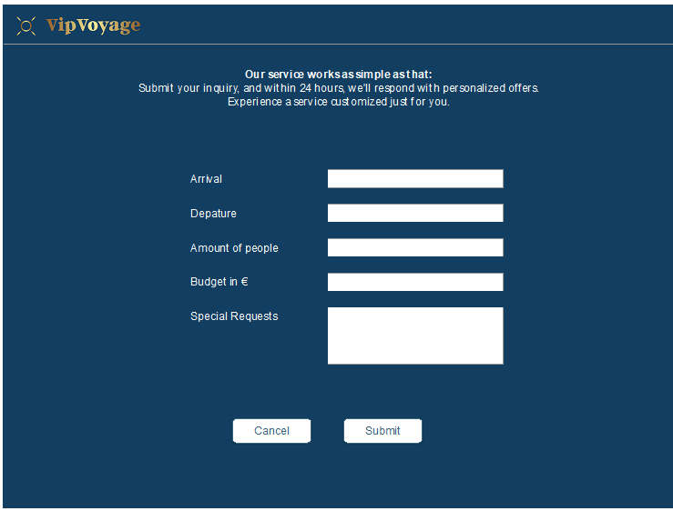
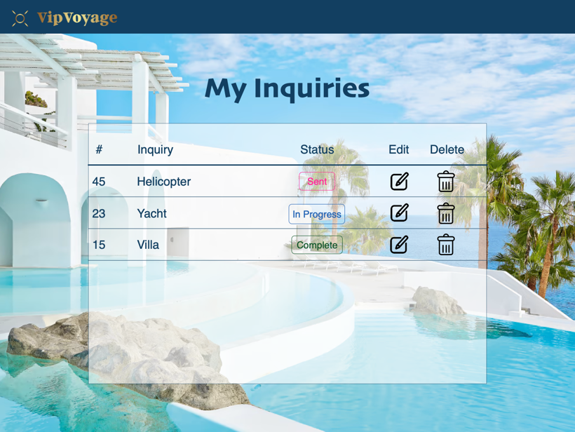

{: .label }
Rayan

# App behavior
{: .no_toc }

## Homepage 

Über den Button mit der Aufschrift "Send Inquiry" stellt man eine Anfrage zum benötigten Service.

## Service Screen

Es sind vier Bilder zu sehen, die verschiedene angebotene Dienstleistungen darstellen: eine luxuriöse Villa..., eine Yacht auf dem Meer und Premium-Autos.
Mit einem Klick auf einem Bild gelangt der Benutzer zum Formular, um die Buchungsanfrage zu stellen.

## Send Inquiry Screen

Auf diesem Screen ist das Formular, das Nutzer ausfüllen können, um eine Anfrage zu senden.
Es gibt Textfelder für die Eingabe des Ankunftsdatums, des Abreisedatums, der Anzahl der Personen, des Budgets. Zwei Buttons "Cancel" und "Submit" befinden sich am unteren Rand, wobei "Submit" dazu dient, das ausgefüllte Formular abzusenden.

## Edit&Delete Inquiry

Auf diesem Bildschirm können Benutzer ihre Anfragen verwalten.

### Tabelle mit Anfragen:

Spalte "#" (ID der Anfrage): Hier wird eine eindeutige Nummer jeder Anfrage aufgeführt, die als Identifikationsnummer dient, um die Anfragen zu unterscheiden.
Spalte "Inquiry" (Art der Anfrage): Diese Spalte zeigt die Art der Dienstleistung an, wie z.B. "Helicopter", "Yacht" und "Villa".
Spalte "Status" (Status der Anfrage): Hier wird der aktuelle Status jeder Anfrage angezeigt, "Sent" (gesendet), "In Progress" (in Bearbeitung) und "Complete" (abgeschlossen).

### Bearbeitungs- und Löschfunktionen:

Edit Button (Bearbeiten): Dieser Button ermöglicht es dem Benutzer, eine Anfrage zu bearbeiten. Wenn der Benutzer auf diesen Button klickt, wird er zum Formular geführt, in dem er die Details seiner Anfrage ändern kann.
Delete Button (Löschen): Mit diesem Button kann der Benutzer eine Anfrage aus der Liste löschen.

{: .text-delta }

Table of contents

+ ToC
{: toc }

