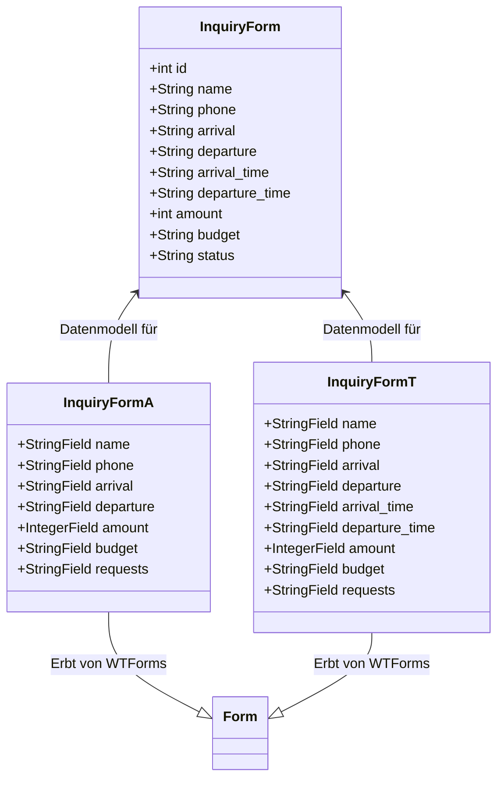

{: .label }
Birte

# Data model
{: .no_toc }

{: .text-delta }

Table of contents

+ ToC
{: toc }

{: .download }
> Unter diesem Link befindet sich das Ablaufdiagram.
>file:///Users/lanakarout/Downloads/Ablauf_VIPVOYAGE.drawio.html

