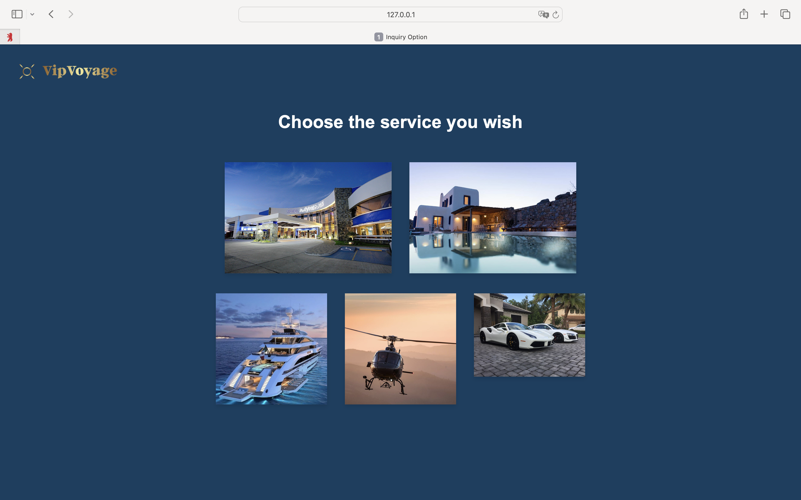

{: .label }
Lana

# Reference documentation
{: .no_toc }

{: .text-delta }

Table of contents

+ ToC
{: toc }

 

## Home Page

### `home()`

**Route:** `/`

**Methods:** `GET`

**Purpose:** Renders the home page of VIP Voyage.

**Sample output:**

---

## Login

### `login()`

**Route:** `/login`

**Methods:** `GET`, `POST`

**Purpose:** Renders the login page and processes login attempts. On successful login, redirects to the booking overview page. On failure, flashes an error message.

**Sample output:**

---

## Inquiry Option

### `inquiry_option()`

**Route:** `/inquiryoption`

**Methods:** `GET`

**Purpose:** Renders the inquiry option page.

**Sample output:**

---

## Inquiry Form (Accommodation)

### `inquiryform_a()`

**Route:** `/inquiryform-a`

**Methods:** `GET`

**Purpose:** Renders the inquiry form Accommodation.

**Sample output:**

---

## Inquiry Form (Transportation)

### `inquiryform_t()`

**Route:** `/inquiryform-t`

**Methods:** `GET`

**Purpose:** Renders the inquiry form Transportation.

**Sample output:**
