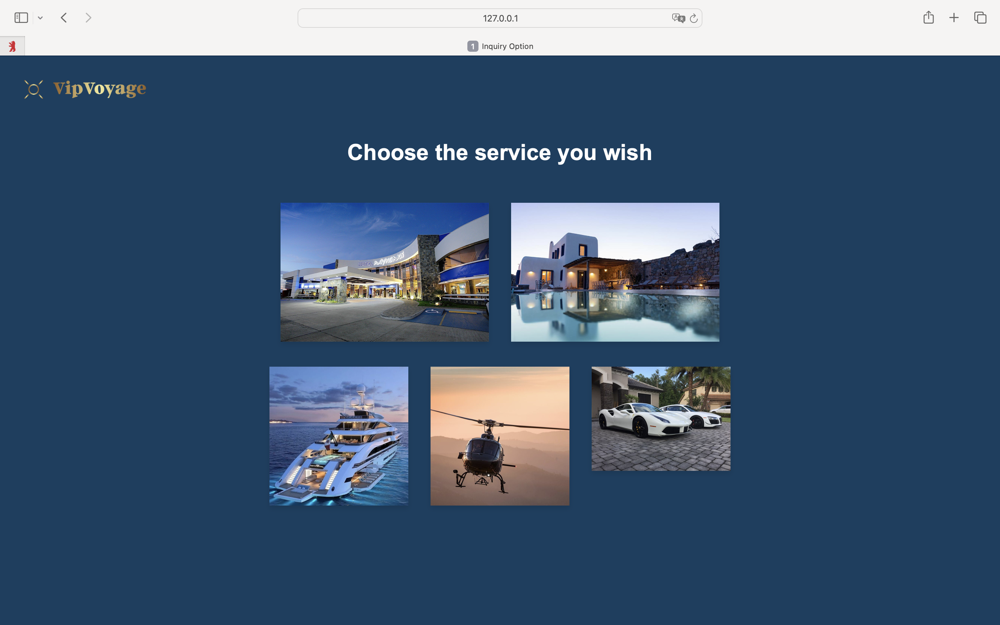

{: .label }
Lana

# Reference documentation
{: .no_toc }

{: .text-delta }

Table of contents

+ ToC
{: toc }

 

## Home Page

### `home()`

**Route:** `/`

**Methods:** `GET`

**Purpose:** Renders the home page of VIP Voyage.

**Sample output:**

---

## Inquiry Option

### `inquiry_option()`

**Route:** `/inquiryoption`

**Methods:** `GET`

**Purpose:** Renders the inquiry option page.

**Sample output:**

---

## Inquiry Form (Type A)

### `inquiryform_a()`

**Route:** `/inquiryform-a`

**Methods:** `GET`

**Purpose:** Renders the inquiry form type Accommodation.

**Sample output:**

---

## Inquiry Form (Type T)

### `inquiryform_t()`

**Route:** `/inquiryform-t`

**Methods:** `GET`

**Purpose:** Renders the inquiry form type Transportation.

**Sample output:**
